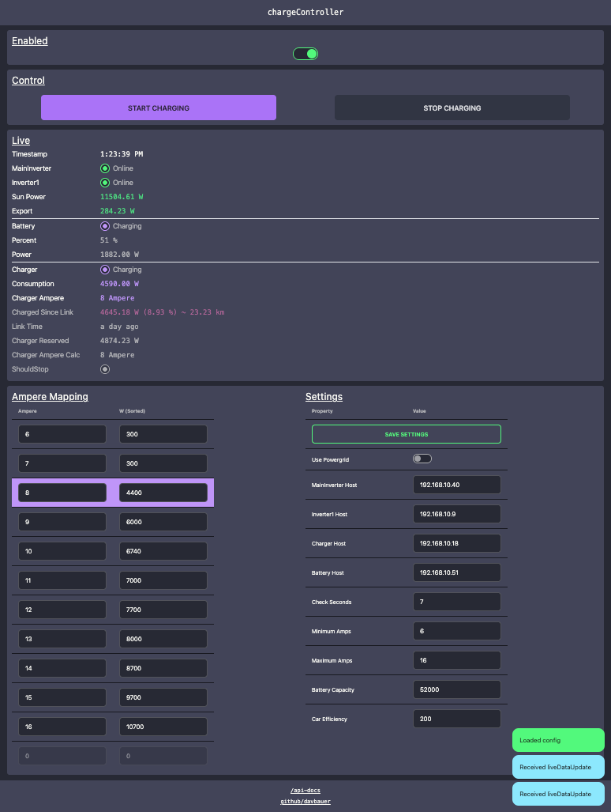

# chargeController

## Summary

A way to dynamically control the charging power of an electric vehicle charger based on Photovoltaic panels!

## Build Status

|      | Build Status                                                                                                                     |
| ---- | -------------------------------------------------------------------------------------------------------------------------------- |
| main |  |
| dev  |     |

## Preview



## Setting up developement envirement

New terminal window

```bash
yarn           # Install packages
yarn dev       # Run frontend
```

New terminal window

```bash
cd ./backend   # Change dir to 'backend'
yarn           # Install packages
yarn dev       # Run backend
```
