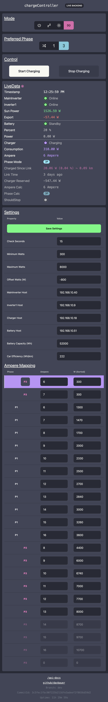

# chargeController

## Preview



## Setting up

```bash
yarn           # Install packages
yarn dev       # Run frontend
```
Open new terminal window
```bash
cd ./backend   # Change dir to 'backend'
yarn           # Install packages
yarn dev       # Run backend
```
